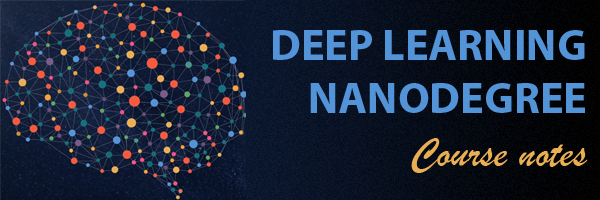
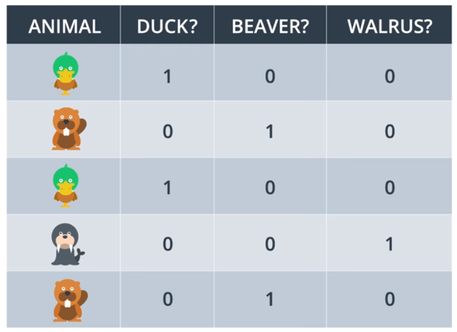
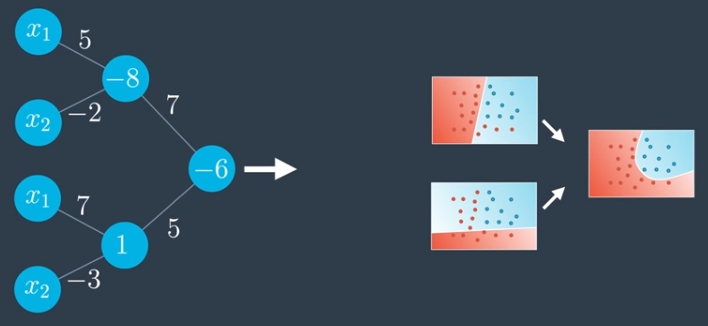
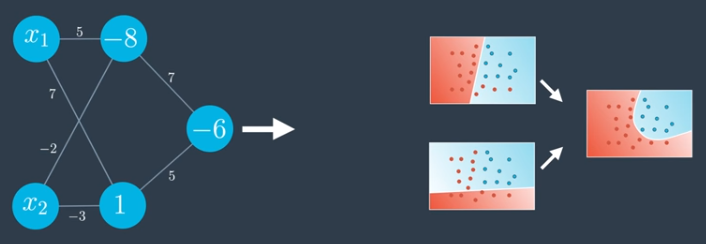
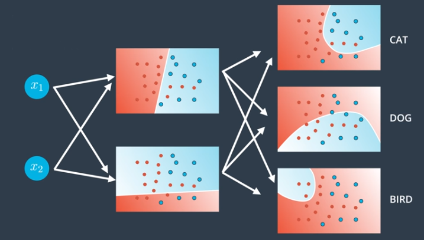
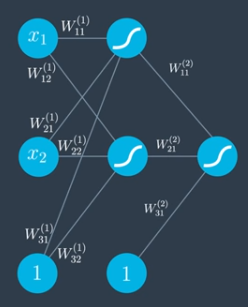
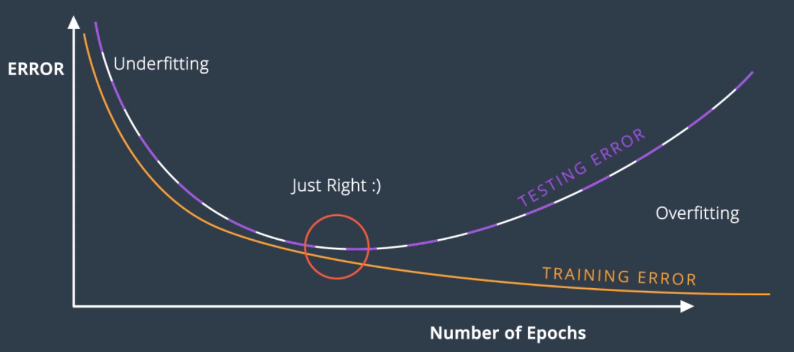

**Note** These are notes I took while doing the [Udacity Deep Learning Nanodegree](https://eu.udacity.com/course/deep-learning-nanodegree--nd101) program. All rights of the images found in these notes and in the jupyter notebooks go to [Udacity](https://udacity.com) unless explicitly notated. You can see them online [here](https://ibesora.github.io/udacity-deeplearning-notes/)

# Notes
## Python and NumPy refresher
[NumPy](https://docs.scipy.org/doc/numpy/reference/) is a math Python library written in C that performs a lot better than base Python.

[ndarray](https://docs.scipy.org/doc/numpy/reference/arrays.html) objects are used to represent any kind of number. They are like lists but they can have any number of dimensions. We'll use them to represent scalars, vectors, matrices or tensors.

NumPy lets you specify number types and sizes so instead of using the basic Python types: `int`, `float`, etc. we'll use `uint8`, `int8`, `int16`, ...

To create a scalar we'll create a NumPy ndarray with only one element as `scalar = np.array(3)`

To see the shape of an ndarray we'll use `scalar.shape`. In the case of a scalar value it will print `()` as it has 0 dimensions

To create a vector we'll pass a Python list to the array function `vector = np.array([1, 2, 3])`. Using `vector.shape` would return `(3,)`. We can use advanced indexing such as `vector[1:]` as well. That would return a new vector with the elements from 1 onward. You can read the documentation on NumPy slicing [here](https://docs.scipy.org/doc/numpy/reference/arrays.indexing.html)

To create matrices we'll pass a list of lists where each list is a matrix row: `matrix = np.array([1, 0, 0], [0, 1, 0])`. `matrix.shape` would then return `(2, 3)` showing that it has two rows with three columns each. To create tensors we'll passa a list of lists of lists of lists and so on. 

NumPy allows to change the shape of an array without changing the underlying data. For example, we can use `vector.reshape(1, 3)` to convert the vector to a 1x3 matrix. You can find the reshape documentation [here](https://docs.scipy.org/doc/numpy/reference/generated/numpy.reshape.html). We can also use slicing to reshape the vector. For example `vector[:, None]` would return a 3x1 matrix and `vector[None, :]` a 1x3 one

Numpy also helps us to perform element wise operators. Instead of looping through the array and performing an operation to each element we can use something like `ndarray + 5`. Notice that when the elements on both sides of an operator are matrices, NumPy also performs element wise operations. If we want to perform mathematically correct matrix multiplication we can use the [matmul](https://docs.scipy.org/doc/numpy/reference/generated/numpy.matmul.html#numpy.matmul) function. To recap: Given two matrices stored in `ndarray`s `m` and `n`, `m*n` would perform element wise multiplication and `np.matmul(n,m)` would perform mathematically correct matrix multiplication. 

## Introduction to Neural Networks

### Perceptrons
Perceptrons are the building blocks of Neural Networks. If we compare a Neural Network with the brain, perceptrons would be the neurons. They work on a set of inputs and produces an output in the same way a neuron works.

What they do is the following: Given a set of inputs and weights (the contribution of each input to the final result) they return an answer to the question we are asking. The simplest question we can ask is if an element belongs to a binary classification or not. 

Take for example the university acceptance where acceptance comes from a relation between the course grades and the entrance test exam grade. We can classify all the students in two classes (accepted (blue) or not (red)) and plot their grades in a 2d graph.  


The perceptron that answers this question would be like the following: 

Where the **Step function** is what's called the **activation function**: The function that translates the output of the perceptron to the answer of our question.

The neat thing about neural networks is that instead of computing the weights ourselves, we give them the output and they compute the weights themselves.

#### Perceptron algorithm
We can compute the weights of a perceptron the following way:
* Start with random weights: $$w_1, ..., w_n, b$$
* For every misclassified point $$(x_1, ..., x_n)$$
	* If $$prediction == 0$$
		* For $$i=1..n$$
			* $$w_i = w_i + \alpha x_i$$ 
		* $$b = b + \alpha$$
	* If $$prediction == 1$$
		* For $$i=1..n$$
			* $$w_i = w_i - \alpha x_i$$ 
		* $$b = b - \alpha$$


Where $$\alpha$$ is the **learning rate**. We can repeat the loop on the misclassified points until the error is as small as we want or a fixed number of steps.

To minimize the error we'll use a technique called [gradient descent](#gradient-descent) but to do so we need continuous prediction values and errors. Instead of answering _Is this point correctly classified?_ with a _Yes_ or _No_, we want the answer to be _53.8% likely_. We do that by changing the **step function** and using the **sigmoid function** as the **activation function**. The sigmoid function is defined as follows:

$$$\sigma(x) = \frac{1}{(1 + e^{-x})}$$$

Then we can use the following formula as the **error function** introduced by each point:

$$$E = y - \hat{y}$$$

where $$y$$ is the actual label and $$\hat{y}$$ is the prediction label of our model

### Softmax
When instead of having a binary classification problem we have multiple classes we can compute the probability of being each class by using the **softmax** function. Let's say we have $$N$$ classes and a linear model that gives us the scores $$Z_1, ..., Z_N$$, the probability of being of class $$i$$ is:

$$$P(i) = \frac{e^{Z_i}}{e^{Z_1} + ... + e^{Z_N}}$$$


### One-Hot encoding
We have always worked with numerical properties but sometimes the data has non numerical properties. To use those in our model we have to convert them to numerical properties and we do that using a technique called **one-hot encoding**. What it does is it creates a column per each possible value of the property and sets a $$1$$ to the column value each row has and $$0$$ otherwise. Defining it that way assures that only one of the value columns per property is $$1$$


### Gradient descent
In order to minimize the error function we must first compute which is the direction that maximizes the descent at each step. We'll take the negative of the gradient of the error function at each step. That assures the error at each step is lower than the error at the previous one. If we repeat this procedure we'll arrive at the minimum of the error function but that isn't always the absolute minimum. In order to not get stucked in some local minimum a number of different techniques can be used. The mathematic definition of the gradient is the following one:

$$$\bigtriangledown E=(\frac{\delta E}{\delta W_1}, ..., \frac{\delta E}{\delta W_N}, \frac{\delta E}{\delta b})$$$

When using the **sigmoid** function as the **activation function** the derivative is the following one:

$$$\sigma'(x) = \frac{\delta}{\delta x}\frac{1}{(1 + e^{-x})}$$$
$$$\sigma'(x) = \frac{e^{-x}}{(1+e^{-x})^2}$$$
$$$\sigma'(x) = \frac{1}{1+e^{-x}}\cdot\frac{e^{-x}}{1+e^{-x}}$$$
$$$\sigma'(x) = \sigma(x)(1 - \sigma(x))$$$

For a point with coordinates $$(x_1, ..., x_n)$$, label $$y$$ and prediction $$\hat{y}$$, the gradient of the error function at that point is:

$$$\bigtriangledown E = -(y - \hat{y})(x_1, ..., x_n, 1)$$$

Therefore, at each step we must update the weights in the following way:

$$$ w_i' = w_i - \alpha[-(y - \hat{y})x_i] $$$
$$$ w_i' = w_i + \alpha(y - \hat{y})x_i $$$
$$$ b' = b + \alpha(y - \hat{y}) $$$

Note that since we've taken the average of errors, the term we are adding should be $$\frac{1}{m}\cdot\alpha$$ instead of $$\alpha$$.

### Non-linear models
What happens if the classification boundary can't be represented with just a line and we need more complex shapes? The answer is to use multi-layer perceptrons or what's the same, a Neural Network. 

The trick is to use two or more linear models and combine them into a nonlinear model. Formally, we calculate the probability in each model, add them via a weighted sum and use the sigmoid function as the activation function to have a value between 0 and 1. We can express that as a linear combination of the two models:


Or using simplified notation:

Where the first layer is called the **input layer**, the final one is called the **output layer** and the ones in-between are called the **hidden layers**. **Deep Neural Networks** are a kind of Neural Networks where there are a lot of hidden layers.

Notice that we are not limited to having only one node in the output layer. In fact, doing multi-class classification requires to have an output node per each class, each of them giving the probability of the element being in that class.


### Feedforward
**Feedforward** is the process used by **Neural networks** to generate an output from a set of inputs.
Given the column vector of inputs and bias $$v=\begin{pmatrix} x_1 \\ ... \\ x_n \\ 1\end{pmatrix}$$, a set of weights $$W^k_l$$ where $$l$$ is the index of the weight (as a pair of $$ij$$ where $$i$$ is the input number index and $$j$$ is the destination node index) and $$k$$ is the layer index. Then the prediction for a neural network with two inputs and two layers using the **sigmoid** as the **activation function** as shown in the following image 
 

can be written as the following equation:

$$$\hat{y} = \sigma\begin{pmatrix}W^2_{11} \\ W^2_{21} \\ W^2_{31}\end{pmatrix}\sigma\begin{pmatrix}W^1_{11} && W^1_{12}\\W^1_{21} && W^1_{22}\\W^1_{31} && W^1_{32}\end{pmatrix}\begin{pmatrix}x_1 \\ x_2 \\ 1\end{pmatrix}$$$

#### Implementation
This sample code implements a forward pass through a 4x3x2 network, with **sigmoid** activation functions for both output layers:

```python
import numpy as np

def sigmoid(x):
    return 1/(1+np.exp(-x))

# Network size
N_input = 4
N_hidden = 3
N_output = 2

np.random.seed(42)
# Make some fake data
X = np.random.randn(4)

weights_input_to_hidden = np.random.normal(0, scale=0.1, size=(N_input, N_hidden))
weights_hidden_to_output = np.random.normal(0, scale=0.1, size=(N_hidden, N_output))


# Make a forward pass through the network
hidden_layer_in = np.dot(X, weights_input_to_hidden)
hidden_layer_out = sigmoid(hidden_layer_in)

output_layer_in = np.dot(hidden_layer_out, weights_hidden_to_output)
output_layer_out = sigmoid(output_layer_in)
```

### Backpropagation
**Backpropagation** is the method used to train the network. What it does in short is to update the starting weights every time the error is bigger than a fixed value. In a nutshell, after a feedforward operation:
1. Compare the output of the model with the desired output and calculate the error
2. Run the feedforward operation backwards to spread the error to each weight
3. Continue this until we have a model that's good

Mathematically the weight update is performed as

$$$ W^{\prime k}_{ij} \gets W^k_{ij} - \alpha\frac{\delta E}{\delta W^k_{ij}} $$$

Note that in order to implement a Neural Network the **error function** used is usually not the one defined before as when the error is big, the error is negative.
Instead, we'll use the **sum of squared errors* that's defined as $$ E = \frac{1}{2} \sum_{\mu} (y^{\mu} - \hat{y}^{\mu})^2 $$ where $$ \mu $$ is the index of each point. And then, the derivative used to update the weights at each backpropagation step is done as follows:

$$$ \frac{\delta E}{\delta w_i} = \frac{\delta}{\delta w_i}\frac{1}{2}(y - \hat{y})^2$$$
$$$ \frac{\delta E}{\delta w_i} = \frac{\delta}{\delta w_i}\frac{1}{2}(y - \hat{y(w_i)})^2$$$
$$$ \frac{\delta E}{\delta w_i} = (y - \hat{y})\frac{\delta}{\delta w_i}(y - \hat{y})$$$
$$$ \frac{\delta E}{\delta w_i} = -(y - \hat{y})f^{\prime}(h)x_i$$$

#### Implementation
The following sample code calculates the backpropagation step for two sets of weights

```python
import numpy as np

def sigmoid(x):
    return 1 / (1 + np.exp(-x))

x = np.array([0.5, 0.1, -0.2])
target = 0.6
learnrate = 0.5

weights_input_hidden = np.array([[0.5, -0.6],
                                 [0.1, -0.2],
                                 [0.1, 0.7]])

weights_hidden_output = np.array([0.1, -0.3])

## Forward pass
hidden_layer_input = np.dot(x, weights_input_hidden)
hidden_layer_output = sigmoid(hidden_layer_input)

output_layer_in = np.dot(hidden_layer_output, weights_hidden_output)
output = sigmoid(output_layer_in)

## Backwards pass
## Calculate output error
error = target - output

# Calculate error term for output layer
output_error_term = error * output * (1 - output)

# Calculate error term for hidden layer
hidden_error_term = np.dot(output_error_term, weights_hidden_output) * \
                    hidden_layer_output * (1 - hidden_layer_output)

# Calculate change in weights for hidden layer to output layer
delta_w_h_o = learnrate * output_error_term * hidden_layer_output

# Calculate change in weights for input layer to hidden layer
delta_w_i_h = learnrate * hidden_error_term * x[:, None]
```

### Putting everything together
Here's the general algorithm for updating the weights with gradient descent:

* Set the weight step to zero: $$\Delta w_i = 0$$
* For each record in the training data:
	* Make a forward pass through the network, calculating the output $$\hat y = f(\sum_i w_i x_i)$$
	* Calculate the error term for the output unit, $$\delta = (y - \hat y) * f'(\sum_i w_i x_i)$$
	* Update the weight $$\Delta w_i = \Delta w_i + \delta x_i$$
* Update the weights $$w_i = w_i + \eta \Delta w_i / m$$ where $$\eta$$ is the learning rate and $$m$$ is the number of records. Here we're averaging the weight steps to help reduce any large variations in the training data.
* Repeat for $$e$$ epochs.

You can also update the weights on each record instead of averaging the weight steps after going through all the records.

Remember that we're using the sigmoid for the activation function, $$f(h) = 1/(1+e^{-h})$$

And the gradient of the sigmoid is $$f'(h) = f(h) (1 - f(h))$$ where $$h$$ is the input to the output unit, $$h = \sum_i w_i x_i$$

The following sample code implements gradient descent of a single hidden layer neural network that uses the **sigmoid** as the **activation function** for its output:
```python
for e in range(epochs):
    del_w_input_hidden = np.zeros(weights_input_hidden.shape)
    del_w_hidden_output = np.zeros(weights_hidden_output.shape)
    for x, y in zip(features.values, targets):
        ## Forward pass ##
        # Calculate the output
        hidden_input = np.dot(x, weights_input_hidden)
        hidden_output = sigmoid(hidden_input)

        output = sigmoid(np.dot(hidden_output,
                                weights_hidden_output))

        ## Backward pass ##
        # Calculate the network's prediction error
        error = y - output

        # Calculate error term for the output unit
        output_error_term = error * output * (1 - output)

        ## propagate errors to hidden layer

        # Calculate the hidden layer's contribution to the error
        hidden_error = np.dot(output_error_term, weights_hidden_output)

        # Calculate the error term for the hidden layer
        hidden_error_term = hidden_error * hidden_output * (1 - hidden_output)

        # Update the change in weights
        del_w_hidden_output += output_error_term * hidden_output
        del_w_input_hidden += hidden_error_term * x[:, None]

    # Update weights
    weights_input_hidden += learnrate * del_w_input_hidden / n_records
    weights_hidden_output += learnrate * del_w_hidden_output / n_records
```

## Neural Networks problems
### Overfitting and underfitting
**Overfitting** is like trying to kill a fly with a bazooka. We are trying a solution over complicated for the problem at hand. See what happens if we do a too specific classification and try to add a data point that was not there, the purple dog in our image.

Overfitting can also be seen as studying too much, memorizing each letter in the lesson but not knowing how to understand the information there so you can answer something not found in the book.

**Underfitting** is trying to kill godzilla with a fly swatter. We are trying a solution that is too simple and won't do the job. It's also called **error due to bias**. In the following image we can see what happens if we do a too unspecific classification. The cat would also be classified as not animals although it's an animal

Underfitting can also be seen as not studying enough for an exam and failing a test.

### Model complexity graph
In order to validate the model we use two sets, a training one and a testing one. The first one is used to train the network and the second one to validate the results.
As long as the neural network is running the error on the training set would be getting lower and lower. The error on the testing on the other hand starts to increase when the model starts to overfit. In order to not overfit the model we should stop the iterations when the testing error starts to increase, this is called **early stopping**. 

We can see it graphically in the model complexity graph.


### Dropout
If the training set only works on some nodes and not in others, the nodes that get all the work would end with very large weights and ends up dominating all the training. In order to solve this problem, we can deactivate some nodes in each run so they are not used. When that's done, the working nodes have to pick up the slack and take more part in the training. 

What we'll do to drop the nodes is we'll give the algorithm a parameter with the probability that each node gets dropped at a particular run. On average, each node will get the same treatment.

### Common problems
When we were talking about [gradient descent](#gradient-descent) we said that we could get stuck in a local minima instead of the absolute one. The error function cannot distinguish between both types.

Another thing that can happen is the **vanishing gradient**. Taking a look at the **sigmoid** function we can see that when the values are very high or very low the function is almost horizontal. That gives us an almost 0 gradient so each step would be really small and we could end all the steps without arriving to the point that minimizes the error. In order to solve this problem, we can use another **activation function**. One that's used a lot is the **hyperbolic tangent function**:

$$$ tanh(x) = \frac{e^x - e^{-x}}{e^x + e^{-x}} $$$

Since our range is between $$-1$$ and $$1$$ the derivatives are larger.

Another commonly used function is the **Rectified Linear Unit** or **ReLU** in short.

$$$ relu(x) = \begin{cases}x &\text{if } x\geqslant 0 \\ 0 &\text{if } x<0\end{cases}$$$ 

In order to avoid doing a lot of computations and using tons of memory for a single step we'll use **stochastic gradient descent**. If the data is evenly distributed, a small subset of it would give us a pretty good idea of what the gradient would be. What we do is to split all the data into several batches and run each batch through the neural network, calculate the error and its gradient and back-propagate to update the weights. Each step is less acurate than using all the data but it's much better to take a bunch of slightly innacurate steps than to take a good one. 

If the learning rate is too big, you're taking huge steps which could be fast but you might miss the minimum. Doing small steps with a small learning rate guarantees finding the minimum but might make the model really slow. The best learning rates are those which decrease as the model is getting closer to a solution. If the gradient is steep, we take long steps, if it's plain, we take small steps.

One way to avoid getting to local minimums is to use **random restarts**. We start the process from different places and do gradient descent from all of them. This doesn't guarantee finding the absolute minimum but increases it's probability. Another way of doing it is using **momentum**. The idea is to take each step with determination in a way that if you get stuck to a local minimum, you can jump over it and look for another minimum. In order to compute the momentum we can do a weighted average of the last steps. Given a constant $$\beta$$, between $$0$$ and $$1$$ the formula is as follows:

$$$ STEP(n) = STEP(n) + \beta STEP(n-1) + \beta^2 STEP(n-2) + ... $$$

This way, the steps that gradient descent has taken time ago matters less than the ones that happened recently.

## Sentiment Analysis


# Projects
## Predicting bike sharing
A project, with a Neural Network built from scratch to predic the number of bikeshare users on any given day.

You can find the implementation, including a Jupyter Notebook, [here](https://github.com/ibesora/udacity-deeplearning-notes/tree/master/projects/first-neural-network)

# Resources
## Links
### Repositories
* [Fast style transfer repo](https://github.com/lengstrom/fast-style-transfer)
* [DeepTraffic](https://selfdrivingcars.mit.edu/deeptraffic/)
* [Flappy bird repo](https://github.com/yenchenlin/DeepLearningFlappyBird)

### Readings
* [Yes, you should understand backprop](https://medium.com/@karpathy/yes-you-should-understand-backprop-e2f06eab496b)
* [Stanford's CS231n course lecture](https://www.youtube.com/watch?v=59Hbtz7XgjM)

## Books to read
* [Grokking Deep Learning](https://www.manning.com/books/grokking-deep-learning)
* [Neural Networks and Deep Learning](http://neuralnetworksanddeeplearning.com/)
* [The deep learning text book](http://www.deeplearningbook.org/)